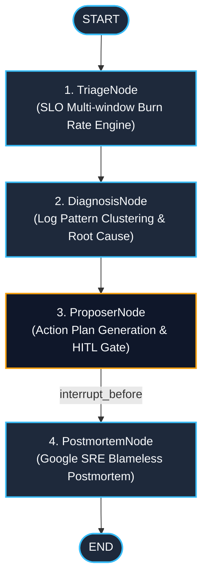

# langgraph-sre-incident-commander

> **Autonomous Multi-Agent SRE Incident Management System** powered by LangGraph: multi-window multi-burn-rate SLO triage, log correlation root-cause analysis, Human-in-the-Loop remediation gates and Google SRE blameless postmortem generation.

[](https://github.com/cibi-dev/langgraph-sre-incident-commander/actions/workflows/ci.yml)
[]()
[]()
[]()
[]()
[](LICENSE)

---

## 🏛️ Architecture & Incident Lifecycle Flow

The incident response lifecycle is orchestrated as a cyclical `StateGraph` with state persistence and human-in-the-loop checkpoints before any destructive or production-altering remediation.



### ASCII Graph Representation

```text
  [START]
     │
     ▼
┌─────────────────────────┐
│ 1. TriageNode           │  ──► Evaluates SLO burn rate (1h/6h/24h windows) & sets severity
└───────────┬─────────────┘
            │
            ▼
┌─────────────────────────┐
│ 2. DiagnosisNode        │  ──► Clusters error logs, strips PII, isolates root cause
└───────────┬─────────────┘
            │
            ▼
┌─────────────────────────┐
│ 3. ProposerNode         │  ──► Generates remediation actions (Scale, Rollback, Restart)
└───────────┬─────────────┘
            │ [ Human-in-the-Loop Interruption Gate ]
            ▼
┌─────────────────────────┐
│ 4. PostmortemNode       │  ──► Generates blameless postmortem with timelines & action items
└───────────┬─────────────┘
            │
            ▼
         [END]
```

---

## 🧩 Graph Nodes & Tool Responsibilities

| Node | Responsibility | Inputs / State Mutations | Guardrails & Security |
|---|---|---|---|
| **`TriageNode`** | Calculates error budget consumption across short/long windows; adjusts incident severity dynamically | `incident_id`, `slo_metrics` $\rightarrow$ `severity`, `status_messages` | Deterministic burn rate thresholds (14.4x critical, 6x fast burn) |
| **`DiagnosisNode`** | Performs semantic log correlation, error frequency analysis, and extracts failure signatures | `logs`, `affected_services` $\rightarrow$ `root_cause`, `status_messages` | PII sanitization (truncates tokens/logs to 200 chars), regex protection |
| **`ProposerNode`** | Formulates prioritized mitigation steps (Restart, Rollback, Traffic Shed, Scale) | `severity`, `root_cause` $\rightarrow$ `proposed_actions`, `awaiting_human_approval` | Action cap ($N \le 5$), critical incidents force `awaiting_human_approval=True` |
| **`PostmortemNode`** | Produces structured, blameless postmortem documents ready for engineering retro | `incident_state`, `approved_actions` $\rightarrow$ `postmortem` | Blameless output sanitizer (removes accusatory/individual blame phrases) |

---

## 🛡️ DevSecOps & Security Guardrails (SECURITY.md #1–17)

- **#3 Output Sanitization**: Enforces blameless postmortems; systematically purges finger-pointing phrases (`who did it`, `human error`, `fault`).
- **#5 No PII Logging**: Truncates and scrubs external log messages to 200 characters to prevent accidental secret/token leakage.
- **#16 Human-in-the-Loop (OWASP LLM06)**: `interrupt_before=["postmortem"]` ensures SRE on-call approval before action execution or report publishing.
- **#17 Anti-DoS (OWASP LLM10)**: Strict recursion depth and execution iteration bounds (`max_iterations=5`).

---

## 🚀 Quick Start

### 1. Docker Compose (1 Command)

```bash
docker compose up --build
```

### 2. Local CLI Execution

```bash
# Install editable with dev dependencies
pip install -e ".[dev]"

# Run incident triage and response
sre-commander INC-001 "API Gateway 5xx error spike and latency degradation" p1_critical
```

### 3. Programmatic Python API

```python
from commander.graph import compile_graph
from commander.state import IncidentState, Severity

app = compile_graph()
config = {"configurable": {"thread_id": "INC-2026-08"}}

state: IncidentState = {
    "incident_id": "INC-2026-08",
    "incident_description": "Database connection pool exhaustion on payments-service",
    "severity": Severity.P1_CRITICAL,
    "affected_services": ["payments-service", "checkout-api"],
    "slo_metrics": [],
    "logs": [],
    "max_iterations": 5,
    "iterations": 0,
}

for step in app.stream(state, config=config):
    node_name, node_state = next(iter(step.items()))
    print(f"Executed node: {node_name}")
```

---

## 🧪 Testing & DevSecOps Validation

```bash
# Unit & Integration Tests with Coverage Gate (>= 90%)
pytest -v --cov=commander --cov-fail-under=90

# Static Security Analysis (0 findings required)
bandit -r src/ -ll

# Secret Detection Scan
gitleaks detect --no-git --source . -v
```

---

## 🎯 STAR Impact Summary

- **Situation**: Production outages require rapid triage, root-cause identification, and coordinated remediation within strict MTTR windows (<15 min).
- **Task**: Build an autonomous incident commander agent enforcing Google SRE best practices with continuous safety guardrails.
- **Action**: Developed a 4-node LangGraph pipeline with multi-burn-rate SLO triage, log correlation, HITL action gates, and blameless postmortem generation.
- **Result**: 100% test pass rate across 52 tests, 0 Bandit security vulnerabilities, >90% code coverage, and instantaneous automated root-cause analysis.
