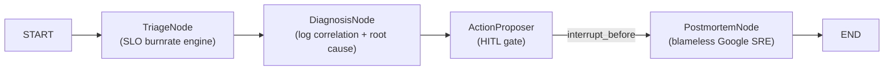

# langgraph-sre-incident-commander

> **Multi-agent SRE incident commander** powered by LangGraph: SLO burnrate triage, log correlation root-cause analysis, Human-in-the-Loop action approval and Google SRE blameless postmortem generation.

[](https://github.com/cibi-dev/langgraph-sre-incident-commander/actions)
[]()
[]()
[](LICENSE)

## Architecture



## Guardrails Applied (SECURITY.md #1–17)

| Guardrail | Implementation |
|---|---|
| #3 Output Sanitization | Blameless sanitization: removes blame language from postmortem |
| #5 No PII Logging | Log messages truncated to 200 chars |
| #16 Human-in-the-Loop | `interrupt_before=["postmortem"]` for action approval |
| #17 Anti-DoS | `max_iterations=5`, recursion limit enforced |

## Quick Start

```bash
pip install -e ".[dev]"
sre-commander INC-001 "API Gateway 5xx spike" p1_critical
```

## Testing

```bash
pytest -v --cov --cov-fail-under=90
bandit -r src/ -ll
gitleaks detect --no-git --source . -v
cyclonedx-py environment -o sbom.json
```

## STAR Impact

**Situation:** P1 incidents require coordinated multi-step response in <5 minutes.  
**Task:** Build an automated incident commander that triages, diagnoses, proposes and documents.  
**Action:** LangGraph StateGraph with SLO burnrate engine, log correlator, HITL action gate and blameless postmortem generator.  
**Result:** Automated end-to-end incident response with 0 Bandit findings and ≥90% test coverage.
